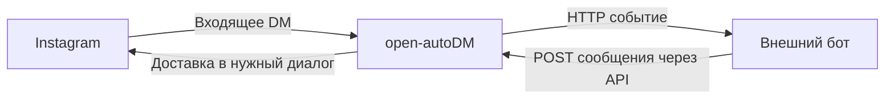

# План API для подключения внешних ботов к Instagram Direct

Дата: 3 октября 2026 года. Статус: транспорт реализован и развёрнут. Ниже сохранён исходный план; итоговая реализация описана в последнем разделе и `docs/BOT_API.md`.

Форк: [N1arko/open-autodm](https://github.com/N1arko/open-autodm).
Исходная версия: `cda1bd1b75b78d0ce57e03ab40cb712ded8c6f9e` от 1 октября 2026 года.

## Задача и принятые решения

open-autoDM принимает сообщения Instagram, передаёт их внешнему боту, принимает сообщения от бота через API и доставляет их в нужный Instagram-диалог. Внешний бот самостоятельно управляет моделью, промптом, памятью и поведением. Боты могут быть реализованы на любом языке и размещены на любом сервере, доступном по согласованному HTTP-контракту.

Подтверждено пользователем:

- Используем форк open-autoDM; приложение размещается на niar42, данные — в одном облачном проекте Supabase Free.
- Первоначально подключаем пять Instagram-аккаунтов; архитектура должна поддерживать рост до 100 подключений и далее.
- Новая часть сервиса — API обмена сообщениями с внешними ботами и маршрутизация ответов.
- Управление ботами, их моделями и персонажами выполняется во внешних системах. Отдельный интерфейс создания ботов в open-autoDM в эту доработку не включён.
- Описания персонажей для реализации транспортного модуля не требуются.

Существующая веб-панель open-autoDM остаётся доступной для подключения Instagram, настроек Meta, сценариев, контактов и аналитики. Регистрация внешних интеграций и привязка аккаунтов выполняются через API; для разработки достаточно документации и примера клиента.

Проект Supabase: `libdjoaymklslcwjjgnk`. [Dashboard](https://supabase.com/dashboard/project/libdjoaymklslcwjjgnk). API: https://libdjoaymklslcwjjgnk.supabase.co. Значения ключей в план и репозиторий не включаются. OpenRouter доступен для внешнего тестового клиента, использующего ИИ; транспортный сервис выполняет обмен сообщениями независимо от этого провайдера.

## Что уже есть в репозитории

| Часть | Существующая реализация | Использование |
|---|---|---|
| Веб-панель | `src/app/(main)/settings`, `dashboard`, `automations`, `analytics` | Подключение и обслуживание Instagram |
| OAuth и выбор аккаунтов | `src/app/api/instagram/*`, `src/hooks/useActiveAccount.ts` | Повторно используем |
| Проверка подписи Meta | `src/app/api/webhook/route.ts` | Сохраняем HMAC перед приёмом событий |
| Маршрутизация входящих | `src/lib/automation/processWebhook.ts` | Добавляем передачу свободных DM интеграции |
| Очередь PostgreSQL | `queue.ts`, `engine.ts`, миграция `20260729000003_*` | Задания передачи боту и отправки в Instagram |
| Отправка сообщения | `src/lib/instagram/api.ts` | Повторно используем `sendInstagramDm()` |
| Обновление токенов | `src/app/api/cron/process-jobs/route.ts` | Регулярное обслуживание на VPS |
| Авторизация владельца | `src/lib/auth.ts`, Supabase Auth | Управление интеграциями и привязками |

Текущие ограничения:

1. Webhook возвращает `200` до записи события: вставка задания выполняется в `after()`. Сбой между подтверждением и записью может потерять сообщение.
2. Обычные DM маршрутизируются по ключевым словам сценариев; общего выхода к внешнему боту пока нет.
3. `dm_logs` и `dm_sent_log` привязаны к automation. Для универсального обмена нужны отдельные журнал сообщений и идентификаторы диалогов.
4. `checkRateLimit()` разрешает отправку при ошибке RPC. Новый маршрут должен откладывать отправку при недоступной проверке.
5. Требуются самостоятельный обработчик очереди и сборка для VPS.

## Контракт обмена сообщениями



Основной режим первого выпуска: сервис доставляет входящие события на зарегистрированный HTTP endpoint бота. Бот подтверждает их получение и возвращает ответы отдельными запросами к API сервиса. Это позволяет обрабатывать сообщения с любой продолжительностью генерации, сохранять собственную историю и отправлять несколько сообщений по одному событию.

Пример события, доставляемого боту:

```json
{
  "version": "1",
  "event_id": "evt_example",
  "type": "message.received",
  "integration_id": "integration_example",
  "account_id": "account_example",
  "conversation_id": "conversation_example",
  "message": {
    "id": "message_example",
    "external_id": "instagram_mid_example",
    "text": "Привет!"
  },
  "sender": { "external_id": "instagram_sender_example" },
  "occurred_at": "2026-10-03T18:00:00Z"
}
```

Повторная доставка сохраняет `event_id`. Бот учитывает его для дедупликации собственной обработки. HTTP `200` или `202` от бота подтверждает приём события; на временные ошибки сервис выполняет ограниченные повторы. Возвращаемый боту payload исключает access tokens Instagram и ключи Supabase.

Пример сообщения от бота к сервису:

```http
POST /api/v1/messages
Authorization: Bearer BOT_ACCESS_TOKEN
Idempotency-Key: reply_example_1
Content-Type: application/json
```

```json
{
  "conversation_id": "conversation_example",
  "in_reply_to_event_id": "evt_example",
  "text": "Привет! Как дела?"
}
```

Сервис определяет Instagram-аккаунт и получателя по сохранённому `conversation_id`, проверяет право интеграции на диалог и ставит отправку в очередь. Ответ `202` содержит внутренний `message_id` и состояние `queued`. Несколько ответов используют разные ключи идемпотентности. Повтор одного запроса возвращает прежний результат; тот же ключ с другим содержимым получает конфликт.

По `GET /api/v1/messages/{messageId}` бот получает состояние: `queued`, `sending`, `sent`, `failed` или `delivery_unknown`. Успешная постановка в очередь и подтверждённая доставка представлены разными состояниями.

Для ботов, которым удобнее получать события самостоятельно, можно добавить pull-режим `GET /api/v1/events` и подтверждение обработанных событий. Он использует тот же журнал, авторизацию и формат событий. Базовый вертикальный проход начинаем с webhook и отправки через API; pull-режим оформляем следующим отдельным этапом. Поддержка других протоколов выполняется адаптером на стороне бота.

## API управления и маршрутизация

| Предлагаемый маршрут | Назначение и авторизация |
|---|---|
| `POST /api/v1/integrations` | Владелец регистрирует имя, webhook URL и параметры доставки; получает токен интеграции |
| `GET /api/v1/integrations` | Владелец получает свои подключения с пагинацией |
| `PATCH /api/v1/integrations/{id}` | Владелец меняет endpoint, режим и включение |
| `PUT /api/v1/accounts/{accountId}/integration` | Владелец привязывает Instagram-аккаунт к интеграции |
| `DELETE /api/v1/accounts/{accountId}/integration` | Владелец отключает передачу сообщений внешнему боту |
| `POST /api/v1/messages` | Интеграция передаёт сообщение для доставки в разрешённый диалог |
| `GET /api/v1/messages/{messageId}` | Интеграция проверяет результат своей отправки |
| `PATCH /api/v1/conversations/{id}` | Владелец ставит пересылку и отправки диалога на паузу или возобновляет их |

Одному Instagram-аккаунту одновременно назначена одна активная интеграция. Одна интеграция может обслуживать несколько аккаунтов. Версия привязки фиксируется с событием и заданием; переназначение аккаунта прекращает приём новых ответов прежней интеграции для этой привязки. Ответы, уже находящиеся в сетевом запросе к Meta, имеют отдельное состояние доставки.

Порядок маршрутизации: кнопки действующей automation-сессии продолжают её сценарий; обычные текстовые DM и текстовые story replies аккаунта с активной привязкой передаются внешнему боту. При отсутствии привязки используется существующая логика сценариев. Автоматизации комментариев сохраняют свой маршрут.

Первый выпуск ограничиваем текстовыми сообщениями. Типы событий и версия контракта оставляют место для вложений и событий доставки. Объединение сообщений, генерация ответа и длинная память находятся на стороне бота; сервис сохраняет порядок и техническую историю обмена.

## Хранение, доступ и надёжность

| Новая таблица | Назначение |
|---|---|
| `bot_integrations` | Владелец, название, webhook URL, включение, ограничения доставки, хэш токена API, зашифрованный секрет подписи webhook |
| `account_bot_bindings` | Аккаунт, интеграция и версия; не более одной активной привязки на аккаунт |
| `webhook_events` | Надёжно принятые события Meta, уникальный внешний ID, состояние маршрутизации |
| `bot_conversations` | Аккаунт и внешний собеседник, состояние паузы, время последнего входящего сообщения |
| `bot_messages` | Входящие и исходящие сообщения, event ID, интеграция и версия привязки, ключ идемпотентности, состояние доставки |
| `bot_event_deliveries` | Копия события для конкретной интеграции, версия маршрута, число попыток, подтверждение и ошибка доставки |

Расширяем `job_queue.job_type` типами `bot_event_delivery` и `bot_message_send`. Payload содержит ссылки на сохранённые события и сообщения. Claim задания, версия маршрута и ограничение одновременной работы с одним диалогом применяются между всеми экземплярами обработчика.

После проверки HMAC webhook Meta атомарно сохраняет событие в Supabase и возвращает подтверждение. При ошибке записи возвращается ошибка, позволяющая Meta повторить доставку. Событие можно передать боту после перезапуска обработчика.

Владелец управляет настройками с проверенным JWT Supabase. Бот использует отдельный токен с доступом только к своей интеграции и её действующим привязкам. При создании привязки проверяется общий владелец аккаунта и интеграции. На таблицах действуют RLS и необходимые ограничения; серверный ключ Supabase используется только в серверном процессе.

Исходящие webhook подписываются отдельным секретом интеграции с event ID и временем запроса. Для внешних endpoint используем HTTPS, ограниченные timeout и размер ответа. Внутренние адреса ботов задаются явным разрешённым списком; redirects и разрешённые адреса проверяются при доставке.

Повтор API-запроса или webhook не создаёт дополнительную отправку. Перед отправкой проверяются привязка, пауза, состояние аккаунта, ограничения Meta и окно ответа по реальному входящему сообщению. Ошибка проверки лимита откладывает отправку. Echo отправленных сообщений исключается из входящих запросов к боту.

Если запрос в Meta мог быть принят, а подтверждение потеряно, сохраняется `delivery_unknown`. Автоматическая повторная отправка такого сообщения прекращается до выяснения результата. Ошибки и состояние доступны через API; абсолютную гарантию единственной доставки при неизвестном результате сетевого запроса текущий код подтвердить не позволяет.

## Масштаб от 5 до 100 подключений

Интеграции и привязки хранятся записями в базе. Один endpoint обслуживает все подключения; обработчик выбирает маршрут по индексу аккаунта. Добавление подключения выполняется через API без изменения кода или перезапуска.

Очередь ограничивает общую параллельность и параллельность для одного аккаунта, распределяет работу между аккаунтами и сохраняет последовательность внутри диалога. Медленный бот занимает ограниченное число мест; его повторы и задержки не блокируют остальные интеграции. При росте потока число экземпляров обработчика увеличивается с сохранением общих блокировок и лимитов в БД.

Тестовый набор содержит 100 интеграций, отдельные аккаунты и диалоги, быстрые, медленные и ошибочные внешние endpoint. Проверяем адресацию, права, дубли, повторную обработку после сбоя, паузу, переназначение маршрута и справедливость очереди. Пропускную способность измеряем по сообщениям в минуту, задержке доставки, возрасту очереди, RAM, нагрузке БД и трафику. Готовность niar42 и Supabase Free к конкретному потоку подтверждается этим измерением.

## Этапы реализации

1. **Контракт и основа API до Instagram.** Миграции, типы, регистрация интеграций, токены, идемпотентность, поддержка новых ключей Supabase. Проверка: управление подключениями и проверка прав доступны без Instagram; пример внешнего клиента принимает событие и вызывает API отправки.
2. **Маршрутизация и надёжный приём.** Запись события перед подтверждением Meta, привязка аккаунта, диалоги, журнал доставки. Проверка: повтор одного события сохраняется один раз; сбой базы не приводит к ложному подтверждению; записанное событие обрабатывается после перезапуска.
3. **Передача боту и доставка его ответа.** Worker, ограниченные повторы webhook, очередь исходящих, существующий `sendInstagramDm()`, API состояния сообщения. Проверка: симуляция Instagram → внешний тестовый бот → правильный аккаунт и собеседник; ключ идемпотентности исключает повторную отправку; echo не создаёт цикл.
4. **Надёжность и масштаб.** Пауза, версии привязок, распределение очереди, ограничения, неопределённая доставка. Проверка: 100 интеграций изолированы; медленный бот не блокирует остальные; ответ старой привязки отвергается; `delivery_unknown` не отправляется повторно автоматически.
5. **VPS и живой пилот.** Docker-сборка, Caddy, регулярное обслуживание, один настоящий Instagram-аккаунт, затем остальные. Проверка: реальное DM получает ответ внешнего бота; очередь и обновление токенов продолжают работать после перезапуска.

До подключения Instagram этапы проверяем локальными событиями и имитацией Meta, отдельным внешним echo-ботом и тестовым клиентом API. Эти проверки подтверждают контракт и маршрутизацию. Живой пилот отдельно подтверждает доступ Meta и фактическую доставку в Instagram. Для реализации нужны проверки типов, production-сборка и интеграционные проверки БД и очереди с воспроизведением сбоев.

## Карта изменений и размещение

Основные места: `supabase/migrations/`, `src/lib/types.ts`, `src/app/api/webhook/route.ts`, `src/lib/automation/processWebhook.ts`, `queue.ts`, `engine.ts`; новые каталоги `src/lib/bot-transport/` и `src/app/api/v1/`. Добавляем точку запуска worker, Dockerfile, Compose-файл, документацию API и минимальный пример внешнего бота. Существующие страницы подключения Instagram используются повторно.

На niar42 размещаем приложение и worker; Supabase остаётся облачным. Модель и память внешнего бота размещаются там, где решит его владелец. Перед развёртыванием выбираем домен для API и панели, обновляем проверку ресурсов и подготавливаем резервную копию. Срез от 3 октября: 4 vCPU, около 5,4 ГиБ доступной памяти, 12 ГиБ свободного диска, диск занят на 84%.

## Доступы и оставшиеся настройки

Ключи OpenRouter, publishable и secret keys Supabase найдены в указанных пользователем заметках. URL проекта записан туда же. Все пять миграций применены; Supabase Auth, прикладные операции и публичный health проверены.

Предоставленные новые ключи Supabase поддерживаем в SDK через `NEXT_PUBLIC_SUPABASE_PUBLISHABLE_KEY` и `SUPABASE_SECRET_KEY` с алиасами для прежних переменных upstream. Для применения SQL-миграций потребуется SQL Editor Dashboard, прямое подключение к БД либо Management API.

К живому пилоту потребуются Meta app и его настройки OAuth/webhook, разрешение на управление сообщениями и endpoint первого внешнего бота. Настройки конкретного ИИ-провайдера и персонажа относятся к этому боту. Адрес сервиса: https://autodm.niar42.com.

## Реализация от 3 октября 2026

Контракт реализован в `docs/BOT_API.md`; порядок запуска — `docs/DEPLOYMENT.md`. Транспорт использует отдельную таблицу `bot_transport_jobs`, которая сохраняет исходную очередь automation и поддерживает собственные аренды, порядок по диалогу и справедливую выборку интеграций. Входящие сообщения одновременно служат событиями для ботов, поэтому отдельная таблица `bot_event_deliveries` не требуется. Ответы обязательно содержат `in_reply_to_event_id`. Нового интерфейса создания ботов нет.

Все пять миграций применены к проекту Supabase `libdjoaymklslcwjjgnk`. Приложение и постоянный worker запущены на niar42 в `/opt/open-autodm`; HTTPS работает через существующий Caddy. Публичный health, вход владельца, создание интеграции, авторизация bot token и отказ для неверного токена проверены. Временная проверочная интеграция удалена.

Пройдены 5 unit и 10 интеграционных тестов с реальным временным PostgreSQL, проверка типов, production build и проверка зависимостей (0 известных уязвимостей). Проверены маршрутизация полного обмена с имитацией Meta, дубли, права, сбои, смена привязки и справедливая очередь для 100 интеграций. Живые Instagram-аккаунты ещё не подключены; реальная доставка через Meta требует пилота.

Срез после запуска: app 98 MiB, worker 86 MiB, около 5,1 GiB доступной памяти на сервере, 14 GiB свободного диска. Это потребление в режиме ожидания; нагрузка от реальных диалогов пока не измерялась.
